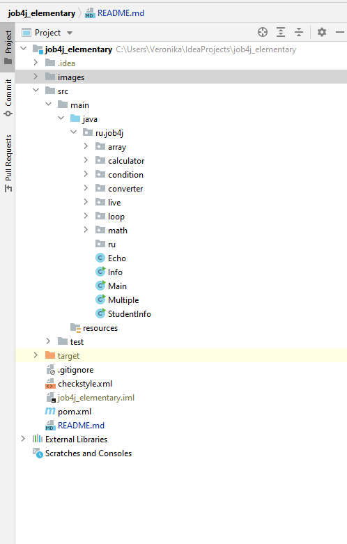

# job4j
Проект содержит решения блока "Базовый синтаксис" курса Job4j уровня Стажер.

Разделы:

- array (матрицы)
- calculator (типы данных)
- condition (оператор ветвления)
- converter (задача "Конвертер валюты")
- live (циклы)
- loop (циклы)
- math

